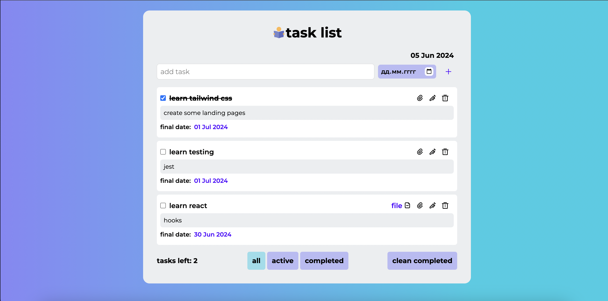

# Task List Application

This project is a Task List application built with Create React App. It allows users to manage tasks by adding, editing, completing, and deleting tasks, as well as uploading files to tasks and filtering tasks based on their completion status.

## Getting Started

This project was bootstrapped with [Create React App](https://github.com/facebook/create-react-app).

## Available Scripts

To start the project, you can run:

### git clone https://github.com/Dariafable/ts-task-list

### cd your-repo

### `npm i`

### `npm run start`

Runs the app in the development mode.\
Open [http://localhost:3000](http://localhost:3000) to view it in the browser.

## Tech stack

- **React**: A JavaScript library for building user interfaces.
- **TypeScript**: A strongly typed programming language that builds on JavaScript.
- **SCSS (Sass)**: A preprocessor scripting language that is interpreted or compiled into CSS. It allows for writing CSS in a more expressive and maintainable way.
- **Firebase**: A platform developed by Google for creating mobile and web applications.
- **Jest**: A delightful JavaScript testing framework with a focus on simplicity.

## Functionality

The Task List application provides the following features:

- **Add a New Task with a Deadline**: Users can add new tasks, each with a specified deadline to keep track of important dates.
- **Toggle Task Completion**: Users can mark tasks as completed or uncompleted to manage their progress.
- **Add a File to a Task**: Users can upload files associated with tasks, useful for attaching relevant documents.
- **Edit a Task**: Users can edit the details of existing tasks, including the title, description, and deadline.
- **Delete a Task**: Users can delete individual tasks that are no longer needed.
- **Delete All Completed Tasks**: Users can delete all tasks that have been marked as completed in one go.
- **Filter Tasks**: Users can filter tasks to view all tasks, only active (incomplete) tasks, or only completed tasks.

## Project Structure

The project is organized as follows:

- **src/components**: Contains React components used in the application.
  - **TaskList**: The main component that displays the list of tasks and the task filter options.
  - **TaskItem**: A component that represents an individual task.
  - **AddTask**: A component that handles adding new tasks.
  - **Modal**: A component used for editing task details in a modal dialog.
- **src/types**: Contains TypeScript type definitions used in the application.
- **src/firebase**: Contains Firebase configuration and initialization.
